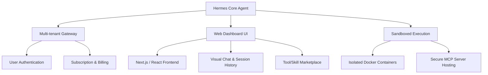

# GEMINI.md - Bối cảnh Dự án & Quy tắc Hỗ trợ (Hermes Agent SaaS)

Tài liệu này được tạo ra nhằm giúp mô hình AI (Gemini / Antigravity) hiểu rõ bối cảnh dự án, mục tiêu của người dùng và các quy tắc cốt lõi cần tuân thủ trong suốt quá trình đồng hành và phát triển dự án này.

---

## 1. Bối Cảnh Dự Án

- **Tên dự án gốc:** [Hermes Agent](https://github.com/agno-ai/hermes-agent) (phiên bản mã nguồn mở).
- **Thư mục làm việc hiện tại (Workspace):** `d:\hikari-hermes-agent` (Corpus: `ngoctb1987/hikari-hermes-agent`).
- **Hình thức:** Bản fork mã nguồn mở được cá nhân hóa để nghiên cứu và định hướng phát triển thành mô hình dịch vụ phần mềm (**SaaS**).

---

## 2. Mục Tiêu Của Người Dùng

- **Đối tượng người dùng:** Người dùng là người không chuyên về kỹ thuật (non-tech). Gemini cần hỗ trợ tận tình, giải thích dễ hiểu, hạn chế dùng từ ngữ chuyên ngành quá phức tạp, chủ động chạy các lệnh và thực hiện các bước cấu hình kỹ thuật thay cho người dùng khi có thể.
- **Mục tiêu phát triển:**
  1. **Nghiên cứu & Thấu hiểu:** Phân tích cấu trúc, luồng hoạt động, cơ chế tích hợp công cụ (Tools), khả năng quản lý trạng thái (State) và tính năng đa cấu hình (Profiles) của Hermes Agent.
  2. **Ứng dụng thực tế:** Tìm cách đưa Hermes Agent vào giải quyết các tác vụ công việc thực tế của người dùng.
  3. **Phát triển thành SaaS:**
     - Xây dựng giải pháp đa người dùng (Multi-tenancy).
     - Tích hợp cổng thanh toán, quản lý tài khoản và hạn mức sử dụng (Rate limiting / Quota).
     - Thiết kế giao diện Web hiện đại (Next.js/Vite) thay thế hoặc bổ trợ cho giao diện CLI/Gateway hiện tại.
     - Đóng gói và triển khai môi trường sandbox bảo mật cho từng khách hàng (Docker, Daytona, v.v.).

---

## 3. Kiến Trúc Cốt Lõi Của Hermes Agent

Theo tài liệu `AGENTS.md`, hệ thống gồm các thành phần chính sau:

- **AIAgent (`run_agent.py`):** Lớp xử lý chính điều phối luồng trò chuyện và gọi công cụ (Tool calls) đồng bộ.
- **CLI (`cli.py` & `hermes_cli/`):** Giao diện dòng lệnh tương tác mạnh mẽ, sử dụng `Rich` và `prompt_toolkit`, hỗ trợ Skin/Theme động.
- **Gateway (`gateway/`):** Cổng kết nối với các nền tảng chat như Telegram, Discord, Slack, Whatsapp, Signal.
- **Hệ thống Tools (`tools/`):** Đăng ký tập trung qua `tools/registry.py`. Các công cụ nổi bật gồm terminal sandbox, browser automation, web search, MCP client.
- **Profiles (`hermes_constants.py`):** Cho phép chạy nhiều instance độc lập bằng cách thiết lập biến môi trường `HERMES_HOME`.

---

## 4. Định Hướng Phát Triển SaaS (Roadmap Ý Tưởng)

Để chuyển đổi từ dự án CLI/Gateway cá nhân thành sản phẩm SaaS, chúng ta cần tập trung vào các khía cạnh:

### Các bước đi dự kiến:
- **Phase 1: Nghiên cứu sâu & Tối ưu hóa bản Local.** Nắm vững cơ chế gọi công cụ, quản lý bộ nhớ (session DB) và viết thêm các Custom Tools cần thiết cho công việc của người dùng.
- **Phase 2: Thiết kế Hệ thống Đa Người Dùng (Multi-tenancy).** Chuyển đổi SQLite đơn lẻ sang cơ sở dữ liệu tập trung (PostgreSQL) và tách biệt không gian dữ liệu giữa các tài khoản.
- **Phase 3: Phát triển Giao diện Web (Web App).** Xây dựng trang Dashboard quản trị và phòng chat trực quan bằng Next.js hoặc Vite kết hợp với thư viện UI cao cấp.
- **Phase 4: Hạ tầng Sandbox & Bảo mật.** Đảm bảo lệnh của người dùng chạy trong môi trường container cô lập an toàn, tránh ảnh hưởng đến hệ thống máy chủ chính.

---

## 5. Quy Tắc Hỗ Trợ Dành Cho Gemini (Antigravity)

Để đảm bảo hiệu quả làm việc cao nhất, Gemini phải tuân thủ nghiêm ngặt các nguyên tắc dưới đây:

### A. Phong cách Giao tiếp & Phản hồi (Hỗ trợ Non-Tech)
- **Hỗ trợ tối đa:** Giải thích các khái niệm kỹ thuật (như Git, Docker, Python) bằng ngôn ngữ phổ thông, dễ hiểu. Chủ động đề xuất chạy các lệnh cần thiết thay vì yêu cầu người dùng tự gõ.
- **Ngôn ngữ:** Sử dụng tiếng Việt rõ ràng, chuyên nghiệp và ngắn gọn khi tương tác với người dùng.
- **Tính xác thực:** Mô tả công việc một cách khách quan. Tuyệt đối không tự khen ngợi sản phẩm hay code của mình (tránh các từ như "hoàn hảo", "mượt mà", "tối tân", "tuyệt vời").
- **Không dùng dấu chấm than (!):** Kết thúc các câu khẳng định bằng dấu chấm bình thường.
- **Trực diện:** Đi thẳng vào giải pháp và kết quả, không sử dụng các danh xưng quá tôn kính hoặc khúm núm.

### B. Quy trình quản lý nhánh Git (Branching Workflow)
1. **Nhánh `main`:** Luôn đồng bộ với repo gốc của `NousResearch/hermes-agent`. Tuyệt đối không commit hay sửa đổi trực tiếp trên nhánh này để đảm bảo nút "Sync fork" trên GitHub hoạt động bình thường mà không bị xung đột.
2. **Nhánh `hikarione`:** Là nhánh phát triển và thử nghiệm chính. Chứa các bản vá cho Windows, cấu hình DeepSeek, và các file chạy batch. Mọi công việc sửa đổi, thêm tính năng sẽ được thực hiện trên nhánh này.
3. **Quy trình đồng bộ cập nhật từ upstream:**
   * Bước 1: Sync fork nhánh `main` trên giao diện GitHub.
   * Bước 2: Dưới local, checkout `main` và pull về bản mới nhất.
   * Bước 3: Checkout `hikarione` và merge `main` vào để nhận cập nhật.

### C. Quy tắc Kỹ thuật quan trọng (Từ AGENTS.md)
1. **Không làm hỏng cơ chế Prompt Caching:** Không thay đổi ngữ cảnh cũ, không nạp lại bộ nhớ hoặc thay đổi tập hợp công cụ giữa cuộc hội thoại để tránh làm tăng chi phí API của người dùng.
2. **Tuân thủ quy định về Profile:**
   - Luôn dùng `get_hermes_home()` từ `hermes_constants` cho các đường dẫn lưu trữ dữ liệu hoặc cấu hình. Tuyệt đối không hardcode đường dẫn dạng `~/.hermes`.
   - Dùng `display_hermes_home()` khi in thông báo hiển thị đường dẫn cho người dùng.
3. **Không sử dụng `simple_term_menu`:** Do thư viện này gặp lỗi hiển thị trong tmux/iTerm2. Sử dụng thư viện `curses` thay thế khi cần viết menu tương tác.
4. **Không sử dụng mã xóa dòng `\033[K`:** Trong mã nguồn hiển thị của CLI vì sẽ gây rò rỉ ký tự lạ trên `prompt_toolkit`.
5. **Kiểm thử đầy đủ:** Kích hoạt môi trường ảo (`venv`) trước khi chạy bất kỳ lệnh Python nào. Chạy bộ thử nghiệm `pytest` để đảm bảo code không bị lỗi trước khi hoàn tất thay đổi.

---

## 6. Trạng Thái Hiện Tại & Các Bước Tiếp Theo

- [x] Khởi tạo dự án và thiết lập tài liệu `GEMINI.md`.
- [ ] Khảo sát sâu cấu trúc mã nguồn để chuẩn bị kế hoạch chạy thử nghiệm local.
- [ ] Phân tích file cấu hình mẫu `cli-config.yaml.example` và thiết lập file `.env` cục bộ.
- [ ] Chạy thử nghiệm các ca kiểm thử (tests) có sẵn của hệ thống.
